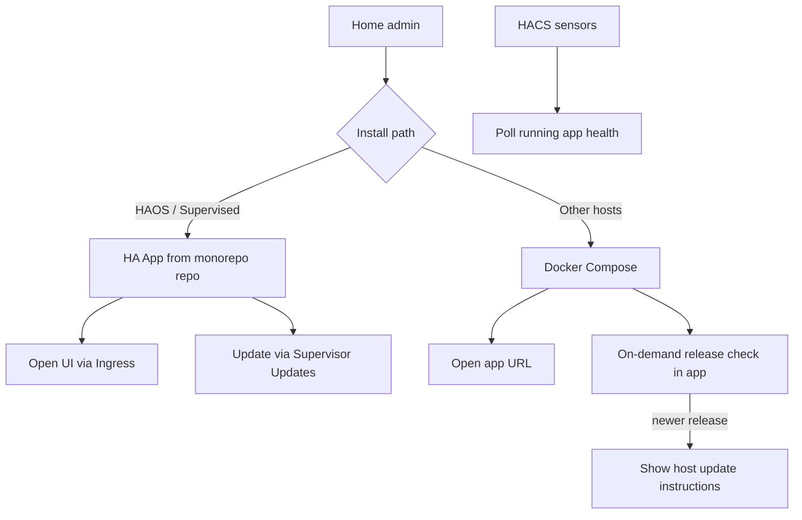

# HA App Install and Updates - Plan

## Goal Capsule

- **Objective:** Make Home Assistant OS/Supervised the primary way to install and update CasaBoard as an HA **App** (formerly add-on) with Ingress and Supervisor Updates, with Compose remaining a documented fallback that can detect newer GitHub Releases and show host-side update instructions.
- **Product authority:** This Product Contract. README / HACS docs must be brought in line when implementing; until then this plan is the source of intended product behavior.
- **Open blockers:** Whether v1 ships with Supervisor **local image builds** or **pre-built multi-arch images on a container registry** (HA’s recommended publish path). See Resolve Before Planning.

---

## Product Contract

### Summary

Ship CasaBoard as a Home Assistant App defined in this monorepo so HAOS users install and update through Supervisor.
Compose stays supported with check-only “update available” against GitHub Releases.
The HACS integration keeps health sensors; the sidebar panel moves to App Ingress.

### Problem Frame

Self-hosted CasaBoard today is `git clone` + `docker compose up -d`, with no first-class update path.
Home Assistant users expect Apps/Updates in HA for companion software; asking them to SSH and rebuild is a poor fit for that audience.
A privileged in-app rebuild (Docker socket / sidecar) can work for Compose, but fights CasaBoard’s simple trusted-LAN model and is the wrong primary story for HAOS.

### Key Decisions

- **HA App is the primary install/update path** — Supervisor owns lifecycle and Updates UI for HAOS/Supervised users. `(session-settled: user-directed — chosen over in-app Compose one-click, HA Update entity as primary, or CasaBoard-only Update: want native HA app packaging)`
- **Compose remains a fallback** — non-HAOS installs keep Docker Compose; they do not get the same Update UX as Supervisor. `(session-settled: user-directed — chosen over add-on-only or shared-image-first packaging)`
- **Compose updates are check-only** — show when a newer GitHub Release exists and give host instructions; no one-click pull/rebuild. `(session-settled: user-directed — chosen over manual-docs-only or sidecar one-click)`
- **Ingress replaces the HACS sidebar panel** — the App serves the UI inside HA; HACS shrinks to sensors (and optional non-panel extras). `(session-settled: user-directed — chosen over keeping iframe panel for all installs)`
- **“Newer” means a published GitHub Release / semver**, not commits on `main`. `(session-settled: user-directed — chosen over tracking default-branch commits or dual release+dev channels in v1)`
- **App packaging lives in this monorepo** — Supervisor custom-repository install from the CasaBoard GitHub repo (`repository.yaml` + app folder). `(session-settled: user-approved — chosen over a separate app repo or community-store-first: one release train)`
- **Compose release checks are on-demand** — when the user opens the update section in the app (default accepted at synthesis confirm).
- **Terminology:** Product and docs should prefer Home Assistant’s current name **App** (formerly add-on), while remaining clear for users who still search “add-on.”

### Actors

- A1. HAOS / Supervised home admin — installs CasaBoard from the App store (custom repo), opens it via Ingress, updates from HA Updates.
- A2. Compose host admin — runs `docker compose`, opens the app by URL, may use HACS sensors against that URL.
- A3. Supervisor — runs the App container, surfaces version/update/install.
- A4. HACS CasaBoard integration — polls app health/sensors; does not own the primary sidebar UI after Ingress lands.

### Key Flows

- F1. HAOS install and open
  - **Trigger:** Admin adds the CasaBoard GitHub repo as a Supervisor App repository and installs CasaBoard.
  - **Actors:** A1, A3
  - **Steps:** Install App; start it; open via Ingress; configure HA connection inside CasaBoard as today.
  - **Outcome:** Dashboards are edited/viewed inside HA without a separate HACS panel registration.
  - **Covered by:** R1, R2, R3, R14

- F2. HAOS update
  - **Trigger:** A newer App version is available in the repository.
  - **Actors:** A1, A3
  - **Steps:** HA Updates shows CasaBoard; admin confirms/installs; Supervisor replaces the App container; dashboard data persists across the update.
  - **Outcome:** Running CasaBoard matches the new App version without host git/compose commands.
  - **Covered by:** R4, R5

- F3. Compose update awareness
  - **Trigger:** Compose admin opens the app’s update section.
  - **Actors:** A2
  - **Steps:** App compares its installed release identity to the latest GitHub Release; if behind, show that an update is available plus copy-pasteable host instructions; if current, show up to date.
  - **Outcome:** Admin knows whether to update and how, without the app rebuilding itself.
  - **Covered by:** R9, R10, R11, R12

### Requirements

**HA App packaging and HAOS UX**

- R1. CasaBoard is installable as a Home Assistant App from this monorepo via Supervisor’s custom repository flow (`repository.yaml` at repo root + App folder with `config.yaml`).
- R2. On HAOS/Supervised, the primary UI entry is App Ingress (sidebar / Open Web UI), not the HACS `panel_custom` iframe.
- R3. App install preserves the local-only product stance: no CasaBoard account/cloud login; HA credentials stay on the user’s machine as today.
- R4. App updates are performed through Home Assistant’s native Updates / Apps update flow (Supervisor), not an in-app rebuild control.
- R5. Dashboard and connection data survive App updates (equivalent durability to today’s Compose `./data` bind mount; use Supervisor `map` / persistent paths as appropriate).
- R14. Ingress follows HA App requirements: enabled in App config; web UI reachable on the configured ingress port; only Supervisor ingress traffic is accepted (HA documents allowing `172.30.32.2` and denying other peers for ingress); Home Assistant handles user authentication at the ingress edge.
- R15. The App repository presentation includes the artifacts HA expects for a public App: intro/docs suitable for the store, `icon.png` / `logo.png`, and a changelog users see on upgrade.
- R16. The monorepo must not introduce additional recursive `config.yaml` files outside the App folder — Supervisor searches the repository for App configs.

**HACS integration**

- R6. The HACS integration continues to expose health-oriented sensors against a running CasaBoard base URL for installs that still need them.
- R7. The HACS integration no longer owns the primary sidebar panel once Ingress is the supported HAOS path; docs describe Ingress for HAOS and direct URL for Compose.

**Compose fallback**

- R8. Compose install remains documented and supported as a fallback for non-HAOS hosts.
- R9. In the Compose-running app, an update section performs an on-demand check against GitHub Releases and reports whether a newer release exists.
- R10. When a newer release exists, the app shows host-side update instructions; it does not pull, rebuild, or recreate containers itself.
- R11. When already on the latest release, the update section reports that clearly.

**Versioning signal**

- R12. “Update available” for Compose is based on published GitHub Release / semver identity, not on commits ahead on `main`.
- R13. App versioning is aligned with the same release train so HAOS and Compose users talk about the same release numbers.

### Acceptance Examples

- AE1. HAOS happy path
  - **Covers:** R1, R2, R4, R14
  - **Given:** Supervisor has the CasaBoard custom App repository.
  - **When:** Admin installs CasaBoard and opens it from the sidebar / Open Web UI.
  - **Then:** The app loads via Ingress (HA-authenticated), and later updates appear under HA Updates rather than requiring SSH.

- AE2. Data survives App update
  - **Covers:** R5
  - **Given:** Pages and HA connection exist in the running App.
  - **When:** Admin installs a newer App version from HA Updates.
  - **Then:** After restart, those pages and the HA connection are still present.

- AE3. Compose behind a release
  - **Covers:** R9, R10, R12
  - **Given:** The running Compose app identifies as an older release than the latest GitHub Release.
  - **When:** Admin opens the update section.
  - **Then:** The UI shows an update is available and gives host instructions; no container rebuild is triggered by the app.

- AE4. Compose current
  - **Covers:** R11
  - **Given:** The running app matches the latest GitHub Release.
  - **When:** Admin opens the update section.
  - **Then:** The UI reports up to date.

- AE5. HACS sensors without panel ownership
  - **Covers:** R6, R7
  - **Given:** A Compose or App instance is reachable at a configured URL.
  - **When:** The HACS integration is configured with that URL.
  - **Then:** Online/pages/connection sensors still work; HAOS users are directed to Ingress for the UI, not a duplicate HACS panel as the primary entry.

### Success Criteria

- A HAOS user can install, open, and update CasaBoard without using git or Compose on the host.
- A Compose user can learn that a newer release exists and what to run, without granting the app Docker privileges.
- README / install docs describe the HA App as primary and Compose as fallback, matching the Product Contract.
- App security posture prefers Ingress and avoids privileged Docker-host APIs (`docker_api` / full host access) that collapse the Supervisor security rating.

### Scope Boundaries

**Deferred for later**

- Compose one-click pull/rebuild (updater sidecar, docker.sock, host agent)
- Home Assistant Community Apps store / default-store submission as a v1 requirement
- HA `update` entity in the custom integration as a parallel install surface (Supervisor Apps updates cover the App)
- Tracking `main` commits or a separate “dev channel” in the Compose update UI
- Replacing non-Docker (bare Node) installs with a first-class update story

**Outside this product's identity**

- Cloud-hosted CasaBoard or mandatory accounts for updates
- Requiring Home Assistant for Compose users (Compose remains standalone-capable)

### Dependencies / Assumptions

- Users on the primary path run Home Assistant OS or Supervised with App support.
- The CasaBoard GitHub repository is (or will be) public so Supervisor can use it as a custom App repository.
- GitHub Releases will be used as the shared version signal for Compose checks and App version bumps.
- Existing `/api/health` remains useful for HACS sensors; it does not need to become the update mechanism.
- HA documents two publish modes: **pre-built registry images** (preferred) and **locally built on the user’s machine** (OK for experimentation; discouraged once established). Which mode is v1 is an open blocker below.

### Outstanding Questions

**Resolve Before Planning**

- Q1. For v1, should CasaBoard ship as **pre-built multi-arch images** to a container registry (e.g. GHCR via Home Assistant builder Actions — HA’s recommended path), or allow **Supervisor local builds** from the monorepo Dockerfile first and migrate to registry images later?

**Deferred to Planning**

- Exact monorepo App layout (folder slug, `config.yaml` fields, ingress port vs current `3000`, persistent `map` paths).
- How the running Compose app learns its installed release identity for comparison.
- Whether HACS panel code is removed immediately or kept temporarily behind docs deprecation.
- Release checklist: bumping App `version`, GitHub Release notes, changelog, and README install rewrite sequencing.
- If Q1 chooses registry images: whether Compose docs/instructions should pull the same published image tag instead of `build: .`.

### Sources / Research

- Current install path: `README.md` (`git clone` + `docker compose up -d`); `Dockerfile` + `docker-compose.yml` (`build: .`, `./data:/data`).
- HACS integration today: `custom_components/casaboard` — config flow, sidebar `panel_custom`, health sensors via `/api/health`; no Update entity; `manifest.json` version `0.1.0`.
- No existing App packaging, Watchtower, GHCR publish workflow, or in-app update check in the repo (as of 2026-07-26 grounding).
- [Developing an app](https://developers.home-assistant.io/docs/apps/) — Apps are container images; repos can host multiple apps; formerly called add-ons.
- [Publishing](https://developers.home-assistant.io/docs/apps/publishing/) — prefer pre-built multi-arch images to a registry; local builds are for experimentation; HA builder GitHub Actions + generic multi-arch image name in `config.yaml` (`image: ghcr.io/...`).
- [Repositories](https://developers.home-assistant.io/docs/apps/repository/) — root `repository.yaml`; users paste the git URL into the Supervisor store.
- [Presentation](https://developers.home-assistant.io/docs/apps/presentation/) — README/DOCS, `icon.png`/`logo.png`, changelog; Ingress (`ingress: true`, default port 8099, allow Supervisor ingress IP only, HA handles auth); security scoring favors Ingress and penalizes `docker_api` / full host access.
- [Configuration](https://developers.home-assistant.io/docs/apps/configuration/) — per-app folder `config.yaml`; Supervisor recursively searches for `config.yaml` (do not use that filename elsewhere in the repo).
- Example: [home-assistant/apps-example](https://github.com/home-assistant/apps-example); builder: [home-assistant/builder](https://github.com/home-assistant/builder).
